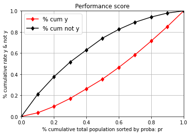
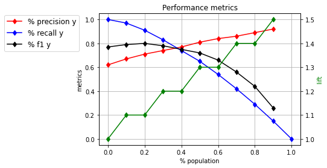
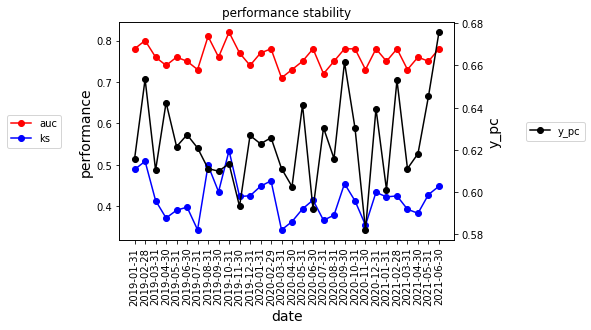
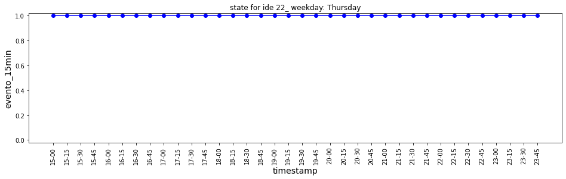
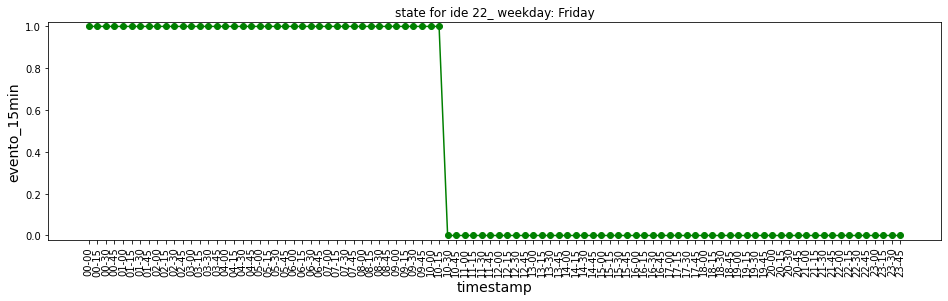
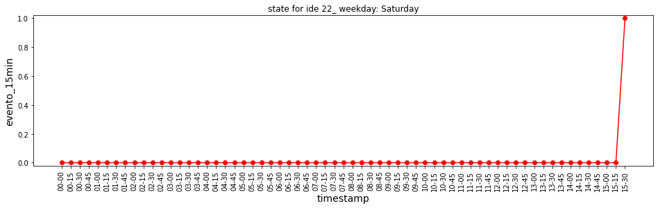
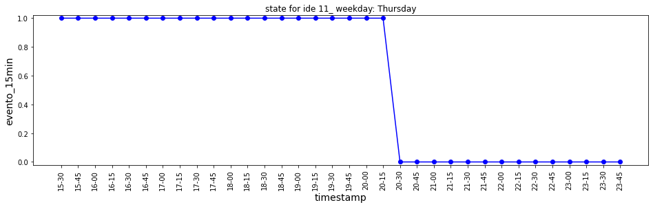
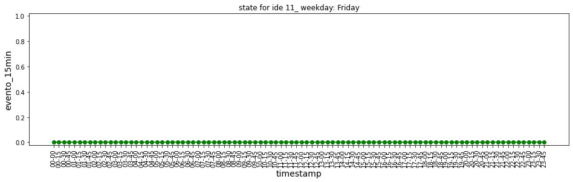
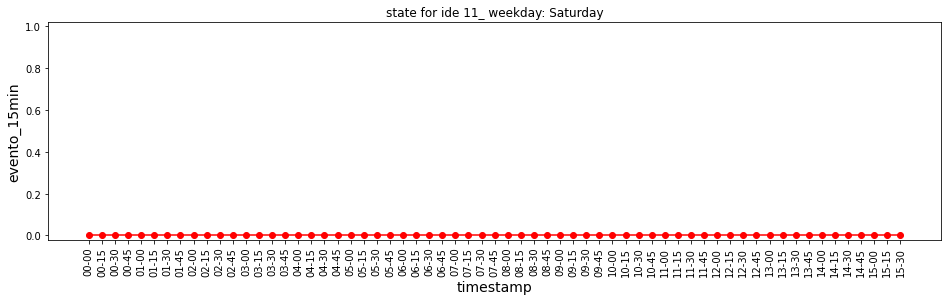

## What is does

Typical evaluation tools for binary models and data transformation for event series.

## Install package


```python
%%capture
!pip3 install git+git://github.com/gabriela-plantie/evaluation_tools
    
```


```python
from evaluation_tools import prediccion as pre
```

## Required packages
import scipy as sc
import statsmodels.formula.api as smf
import statsmodels.api as sm
from matplotlib import pyplot as plt
from scipy import stats
import matplotlib.pyplot as plt
from sklearn.metrics import roc_auc_score
from scipy.stats import ks_2samp
import itertools
## Create example data prediction


```python
import pandas as pd
import numpy as np
import scipy as sc
from scipy.stats import ks_2samp
```


```python
size=10000
ds= pd.date_range('2019-01-01', periods=30, freq='M')
d = np.random.choice(ds, size, replace=True)
x1=np.random.uniform(0,1,size)
x2=np.random.uniform(0,1,size)
x3=np.random.uniform(0,1,size)
x4=np.random.uniform(0,1,size)/5

z = 1 + 2*x1 -4* x2 + 2*x2*x3 + x4
pr = 1/(1+np.exp(-z))
#l=list(pr[(pr>0.94) & ((pr<0.95))])
#l.sort()
#l

#pr[pr>0.95]=1
ide = np.arange(0, size,1)
y=sc.stats.binom.rvs(1, pr, size=size)
df = pd.DataFrame(data={'ide':ide, 'y':y, 'x1':x1, 'x2':x2, 'x3':x3, 'x4':x4, 'pr':pr, 'date': d})

#set(df.date)
```


```python
min(df.pr)
```


    0.060002507311636755


## Apply tools


```python
p=pre.Predictor(df, 'ide', 'pr', 'y', 'date')
p.performance_table(q_group=[100,300])
```

    mean: 0.6234
    events: 6234


    (                  ide    y  y_rate  pc_pob  pc_y  lift
     pr_cut                                                
     (-0.001, 0.298]  1000  214   0.214    0.10  0.03   0.3
     (0.298, 0.414]   1000  375   0.375    0.10  0.06   0.6
     (0.414, 0.507]   1000  472   0.472    0.10  0.08   0.8
     (0.507, 0.59]    1000  569   0.569    0.10  0.09   0.9
     (0.59, 0.661]    1000  578   0.578    0.10  0.09   0.9
     (0.661, 0.723]   1000  686   0.686    0.10  0.11   1.1
     (0.723, 0.778]   1000  746   0.746    0.10  0.12   1.2
     (0.778, 0.831]   1000  814   0.814    0.10  0.13   1.3
     (0.831, 0.884]   1000  858   0.858    0.10  0.14   1.4
     (0.884, 0.92]     600  548   0.913    0.06  0.09   1.5
     (0.92, 0.942]     300  282   0.940    0.03  0.05   1.5
     (0.942, 1.0]      100   92   0.920    0.01  0.01   1.5,
               cum_ide  precision_y  recall_y  f1_y  lift_y
     > cut                                                 
     0.000000    10000         0.62      1.00  0.77     1.0
     0.297841     9000         0.67      0.97  0.79     1.1
     0.413574     8000         0.71      0.91  0.80     1.1
     0.507316     7000         0.74      0.83  0.78     1.2
     0.589650     6000         0.77      0.74  0.75     1.2
     0.660958     5000         0.81      0.65  0.72     1.3
     0.722954     4000         0.84      0.54  0.66     1.3
     0.777920     3000         0.86      0.42  0.56     1.4
     0.830806     2000         0.89      0.29  0.44     1.4
     0.884479     1000         0.92      0.15  0.26     1.5
     0.920036      400         0.94      0.06  0.11     1.5
     0.941824      100         0.92      0.01  0.02     1.5)


```python
p.graph_ks()
```

    KstestResult(statistic=0.3946487926777095, pvalue=0.014741898398902609)
    mean: 0.6234
    events: 6234


    

    


```python
p.graph_others()
```

    mean: 0.6234
    events: 6234


    

    


```python
p.stability()
p.graph_stability()
```


    

    


```python
p.metricas_performance()
```


    {'auc': 0.76, 'ks': 0.3946, 'y_pc': 0.6234}


## Create example data events


```python

def f_to_dt(fecha_hora_min):
    return pd.to_datetime(fecha_hora_min, format='%Y-%m-%d %H:%M')
df= pd.DataFrame()
df['ide_instalacion']=[11,11,11,11,11,11,22,22,22,22]
cli=['2019-08-01 15:30', '2019-08-01 15:40', '2019-08-01 16:30', '2019-08-01 16:31','2019-08-01 20:30','2019-08-01 21:00']
cli2=[ '2019-08-01 15:00', '2019-08-02 10:30', '2019-08-02 15:30', '2019-08-03 15:30']
cli.extend(cli2)
df['fecha']= list(map(f_to_dt, cli))
df['evento']=['A', np.nan, 'D', 'A', 'D', np.nan,'A', 'D', 'D',  'A']
display(df)
```


<div>
<style scoped>
    .dataframe tbody tr th:only-of-type {
        vertical-align: middle;
    }

    .dataframe tbody tr th {
        vertical-align: top;
    }

    .dataframe thead th {
        text-align: right;
    }
</style>
<table border="1" class="dataframe">
  <thead>
    <tr style="text-align: right;">
      <th></th>
      <th>ide_instalacion</th>
      <th>fecha</th>
      <th>evento</th>
    </tr>
  </thead>
  <tbody>
    <tr>
      <th>0</th>
      <td>11</td>
      <td>2019-08-01 15:30:00</td>
      <td>A</td>
    </tr>
    <tr>
      <th>1</th>
      <td>11</td>
      <td>2019-08-01 15:40:00</td>
      <td>NaN</td>
    </tr>
    <tr>
      <th>2</th>
      <td>11</td>
      <td>2019-08-01 16:30:00</td>
      <td>D</td>
    </tr>
    <tr>
      <th>3</th>
      <td>11</td>
      <td>2019-08-01 16:31:00</td>
      <td>A</td>
    </tr>
    <tr>
      <th>4</th>
      <td>11</td>
      <td>2019-08-01 20:30:00</td>
      <td>D</td>
    </tr>
    <tr>
      <th>5</th>
      <td>11</td>
      <td>2019-08-01 21:00:00</td>
      <td>NaN</td>
    </tr>
    <tr>
      <th>6</th>
      <td>22</td>
      <td>2019-08-01 15:00:00</td>
      <td>A</td>
    </tr>
    <tr>
      <th>7</th>
      <td>22</td>
      <td>2019-08-02 10:30:00</td>
      <td>D</td>
    </tr>
    <tr>
      <th>8</th>
      <td>22</td>
      <td>2019-08-02 15:30:00</td>
      <td>D</td>
    </tr>
    <tr>
      <th>9</th>
      <td>22</td>
      <td>2019-08-03 15:30:00</td>
      <td>A</td>
    </tr>
  </tbody>
</table>
</div>


## Apply tools
    


```python

e = pre.Events(df, grouper='ide_instalacion',  datetime_name='fecha', event_name='evento', every_x_minutes=15)

ide=22
display(e.df[e.df.ide_instalacion==ide][:5])
display(e.df[e.df.ide_instalacion==ide][-5:])
a = e.plot_ide(ide_value=ide, event_value_pos='A', figsize=(16,4))

```


<div>
<style scoped>
    .dataframe tbody tr th:only-of-type {
        vertical-align: middle;
    }

    .dataframe tbody tr th {
        vertical-align: top;
    }

    .dataframe thead th {
        text-align: right;
    }
</style>
<table border="1" class="dataframe">
  <thead>
    <tr style="text-align: right;">
      <th></th>
      <th>evento_15min</th>
      <th>ide_instalacion</th>
      <th>evento</th>
    </tr>
  </thead>
  <tbody>
    <tr>
      <th>195</th>
      <td>2019-08-01 15:00:00</td>
      <td>22</td>
      <td>A</td>
    </tr>
    <tr>
      <th>196</th>
      <td>2019-08-01 15:15:00</td>
      <td>22</td>
      <td>A</td>
    </tr>
    <tr>
      <th>197</th>
      <td>2019-08-01 15:30:00</td>
      <td>22</td>
      <td>A</td>
    </tr>
    <tr>
      <th>198</th>
      <td>2019-08-01 15:45:00</td>
      <td>22</td>
      <td>A</td>
    </tr>
    <tr>
      <th>199</th>
      <td>2019-08-01 16:00:00</td>
      <td>22</td>
      <td>A</td>
    </tr>
  </tbody>
</table>
</div>


<div>
<style scoped>
    .dataframe tbody tr th:only-of-type {
        vertical-align: middle;
    }

    .dataframe tbody tr th {
        vertical-align: top;
    }

    .dataframe thead th {
        text-align: right;
    }
</style>
<table border="1" class="dataframe">
  <thead>
    <tr style="text-align: right;">
      <th></th>
      <th>evento_15min</th>
      <th>ide_instalacion</th>
      <th>evento</th>
    </tr>
  </thead>
  <tbody>
    <tr>
      <th>385</th>
      <td>2019-08-03 14:30:00</td>
      <td>22</td>
      <td>D</td>
    </tr>
    <tr>
      <th>386</th>
      <td>2019-08-03 14:45:00</td>
      <td>22</td>
      <td>D</td>
    </tr>
    <tr>
      <th>387</th>
      <td>2019-08-03 15:00:00</td>
      <td>22</td>
      <td>D</td>
    </tr>
    <tr>
      <th>388</th>
      <td>2019-08-03 15:15:00</td>
      <td>22</td>
      <td>D</td>
    </tr>
    <tr>
      <th>389</th>
      <td>2019-08-03 15:30:00</td>
      <td>22</td>
      <td>A</td>
    </tr>
  </tbody>
</table>
</div>


    

    


    

    


    

    


```python
ide=11
display(e.df[e.df.ide_instalacion==ide][:5])
display(e.df[e.df.ide_instalacion==ide][-5:])
a = e.plot_ide(ide_value=ide, event_value_pos='A', figsize=(16,4))

```


<div>
<style scoped>
    .dataframe tbody tr th:only-of-type {
        vertical-align: middle;
    }

    .dataframe tbody tr th {
        vertical-align: top;
    }

    .dataframe thead th {
        text-align: right;
    }
</style>
<table border="1" class="dataframe">
  <thead>
    <tr style="text-align: right;">
      <th></th>
      <th>evento_15min</th>
      <th>ide_instalacion</th>
      <th>evento</th>
    </tr>
  </thead>
  <tbody>
    <tr>
      <th>2</th>
      <td>2019-08-01 15:30:00</td>
      <td>11</td>
      <td>A</td>
    </tr>
    <tr>
      <th>3</th>
      <td>2019-08-01 15:45:00</td>
      <td>11</td>
      <td>A</td>
    </tr>
    <tr>
      <th>4</th>
      <td>2019-08-01 16:00:00</td>
      <td>11</td>
      <td>A</td>
    </tr>
    <tr>
      <th>5</th>
      <td>2019-08-01 16:15:00</td>
      <td>11</td>
      <td>A</td>
    </tr>
    <tr>
      <th>6</th>
      <td>2019-08-01 16:30:00</td>
      <td>11</td>
      <td>A</td>
    </tr>
  </tbody>
</table>
</div>


<div>
<style scoped>
    .dataframe tbody tr th:only-of-type {
        vertical-align: middle;
    }

    .dataframe tbody tr th {
        vertical-align: top;
    }

    .dataframe thead th {
        text-align: right;
    }
</style>
<table border="1" class="dataframe">
  <thead>
    <tr style="text-align: right;">
      <th></th>
      <th>evento_15min</th>
      <th>ide_instalacion</th>
      <th>evento</th>
    </tr>
  </thead>
  <tbody>
    <tr>
      <th>190</th>
      <td>2019-08-03 14:30:00</td>
      <td>11</td>
      <td>D</td>
    </tr>
    <tr>
      <th>191</th>
      <td>2019-08-03 14:45:00</td>
      <td>11</td>
      <td>D</td>
    </tr>
    <tr>
      <th>192</th>
      <td>2019-08-03 15:00:00</td>
      <td>11</td>
      <td>D</td>
    </tr>
    <tr>
      <th>193</th>
      <td>2019-08-03 15:15:00</td>
      <td>11</td>
      <td>D</td>
    </tr>
    <tr>
      <th>194</th>
      <td>2019-08-03 15:30:00</td>
      <td>11</td>
      <td>D</td>
    </tr>
  </tbody>
</table>
</div>


    

    


    

    


    

    


```python
#jupyter nbconvert README.ipynb --to markdown
```
