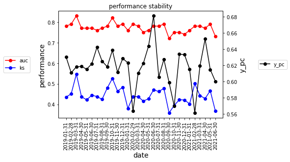

## What is does

Typical evaluation tools for binary models and data transformation for event series.

## Install package


```python
%%capture
!pip3 install git+git://github.com/gabriela-plantie/evaluation_tools
    
```


```python
from evaluation_tools import prediccion as pre
```

## Required packages
import scipy as sc
import statsmodels.formula.api as smf
import statsmodels.api as sm
from matplotlib import pyplot as plt
from scipy import stats
import matplotlib.pyplot as plt
from sklearn.metrics import roc_auc_score
from scipy.stats import ks_2samp
import itertools
## Create example data prediction


```python
import pandas as pd
import numpy as np
import scipy as sc
from scipy.stats import ks_2samp
```


```python
size=10000
ds= pd.date_range('2019-01-01', periods=30, freq='M')
d = np.random.choice(ds, size, replace=True)
x1=np.random.uniform(0,1,size)
x2=np.random.uniform(0,1,size)
x3=np.random.uniform(0,1,size)
x4=np.random.uniform(0,1,size)/5

z = 1 + 2*x1 -4* x2 + 2*x2*x3 + x4
pr = 1/(1+np.exp(-z))
#l=list(pr[(pr>0.94) & ((pr<0.95))])
#l.sort()
#l

#pr[pr>0.95]=1
ide = np.arange(0, size,1)
y=sc.stats.binom.rvs(1, pr, size=size)
df = pd.DataFrame(data={'ide':ide, 'y':y, 'x1':x1, 'x2':x2, 'x3':x3, 'x4':x4, 'pr':pr, 'date': d})

#set(df.date)
```

## Apply tools


```python
p=pre.Predictor(df, 'ide', 'pr', 'y', 'date')
p.performance_table(q_group=[100,300])
```

    media: 0.6183
    events: 6183


<div>

<table border="1" class="dataframe">
  <thead>
    <tr style="text-align: right;">
      <th></th>
      <th>ide</th>
      <th>y</th>
      <th>br</th>
      <th>pc_pob</th>
      <th>pc_y</th>
      <th>lift</th>
    </tr>
    <tr>
      <th>pr_cut</th>
      <th></th>
      <th></th>
      <th></th>
      <th></th>
      <th></th>
      <th></th>
    </tr>
  </thead>
  <tbody>
    <tr>
      <th>(0.0, 0.284]</th>
      <td>1000</td>
      <td>190</td>
      <td>0.190</td>
      <td>0.10</td>
      <td>0.03</td>
      <td>0.3</td>
    </tr>
    <tr>
      <th>(0.284, 0.399]</th>
      <td>1000</td>
      <td>364</td>
      <td>0.364</td>
      <td>0.10</td>
      <td>0.06</td>
      <td>0.6</td>
    </tr>
    <tr>
      <th>(0.399, 0.498]</th>
      <td>1000</td>
      <td>417</td>
      <td>0.417</td>
      <td>0.10</td>
      <td>0.07</td>
      <td>0.7</td>
    </tr>
    <tr>
      <th>(0.498, 0.581]</th>
      <td>1000</td>
      <td>544</td>
      <td>0.544</td>
      <td>0.10</td>
      <td>0.09</td>
      <td>0.9</td>
    </tr>
    <tr>
      <th>(0.581, 0.656]</th>
      <td>1000</td>
      <td>625</td>
      <td>0.625</td>
      <td>0.10</td>
      <td>0.10</td>
      <td>1.0</td>
    </tr>
    <tr>
      <th>(0.656, 0.723]</th>
      <td>1000</td>
      <td>691</td>
      <td>0.691</td>
      <td>0.10</td>
      <td>0.11</td>
      <td>1.1</td>
    </tr>
    <tr>
      <th>(0.723, 0.778]</th>
      <td>1000</td>
      <td>765</td>
      <td>0.765</td>
      <td>0.10</td>
      <td>0.12</td>
      <td>1.2</td>
    </tr>
    <tr>
      <th>(0.778, 0.828]</th>
      <td>1000</td>
      <td>804</td>
      <td>0.804</td>
      <td>0.10</td>
      <td>0.13</td>
      <td>1.3</td>
    </tr>
    <tr>
      <th>(0.828, 0.883]</th>
      <td>1000</td>
      <td>868</td>
      <td>0.868</td>
      <td>0.10</td>
      <td>0.14</td>
      <td>1.4</td>
    </tr>
    <tr>
      <th>(0.883, 0.917]</th>
      <td>600</td>
      <td>543</td>
      <td>0.905</td>
      <td>0.06</td>
      <td>0.09</td>
      <td>1.5</td>
    </tr>
    <tr>
      <th>(0.917, 0.94]</th>
      <td>300</td>
      <td>280</td>
      <td>0.933</td>
      <td>0.03</td>
      <td>0.05</td>
      <td>1.5</td>
    </tr>
    <tr>
      <th>(0.94, 1.0]</th>
      <td>100</td>
      <td>92</td>
      <td>0.920</td>
      <td>0.01</td>
      <td>0.01</td>
      <td>1.5</td>
    </tr>
  </tbody>
</table>
</div>


```python
p.graph_ks()
```

    KstestResult(statistic=0.4116133332875716, pvalue=0.11316651528479127)
    media: 0.6183
    events: 6183


    

    


```python
p.stability()
p.graph_stability()
```


    

    


```python
p.metricas_performance()
```


    {'auc': 0.77, 'ks': 0.4116, 'y_pc': 0.6183}


## Create example data events


```python

def f_to_dt(fecha_hora_min):
    return pd.to_datetime(fecha_hora_min, format='%Y-%m-%d %H:%M')
df= pd.DataFrame()
df['ide_instalacion']=[11,11,11,11,11,11,22,22,22,22]
cli=['2019-08-01 15:30', '2019-08-01 15:40', '2019-08-01 16:30', '2019-08-01 16:31','2019-08-01 20:30','2019-08-01 21:00']
cli2=[ '2019-08-01 15:00', '2019-08-02 10:30', '2019-08-02 15:30', '2019-08-03 15:30']
cli.extend(cli2)
df['fecha']= list(map(f_to_dt, cli))
df['evento']=['A', np.nan, 'D', 'A', 'D', np.nan,'A', 'D', 'D',  'A']
display(df)
```


<div>

<table border="1" class="dataframe">
  <thead>
    <tr style="text-align: right;">
      <th></th>
      <th>ide_instalacion</th>
      <th>fecha</th>
      <th>evento</th>
    </tr>
  </thead>
  <tbody>
    <tr>
      <th>0</th>
      <td>11</td>
      <td>2019-08-01 15:30:00</td>
      <td>A</td>
    </tr>
    <tr>
      <th>1</th>
      <td>11</td>
      <td>2019-08-01 15:40:00</td>
      <td>NaN</td>
    </tr>
    <tr>
      <th>2</th>
      <td>11</td>
      <td>2019-08-01 16:30:00</td>
      <td>D</td>
    </tr>
    <tr>
      <th>3</th>
      <td>11</td>
      <td>2019-08-01 16:31:00</td>
      <td>A</td>
    </tr>
    <tr>
      <th>4</th>
      <td>11</td>
      <td>2019-08-01 20:30:00</td>
      <td>D</td>
    </tr>
    <tr>
      <th>5</th>
      <td>11</td>
      <td>2019-08-01 21:00:00</td>
      <td>NaN</td>
    </tr>
    <tr>
      <th>6</th>
      <td>22</td>
      <td>2019-08-01 15:00:00</td>
      <td>A</td>
    </tr>
    <tr>
      <th>7</th>
      <td>22</td>
      <td>2019-08-02 10:30:00</td>
      <td>D</td>
    </tr>
    <tr>
      <th>8</th>
      <td>22</td>
      <td>2019-08-02 15:30:00</td>
      <td>D</td>
    </tr>
    <tr>
      <th>9</th>
      <td>22</td>
      <td>2019-08-03 15:30:00</td>
      <td>A</td>
    </tr>
  </tbody>
</table>
</div>


## Apply tools
    


```python

e = pre.Events(df, grouper='ide_instalacion',  datetime_name='fecha', event_name='evento', every_x_minutes=15)

ide=22
display(e.df[e.df.ide_instalacion==ide][:5])
display(e.df[e.df.ide_instalacion==ide][-5:])
a = e.plot_ide(ide_value=ide, event_value_pos='A', figsize=(16,4))

```


<div>

<table border="1" class="dataframe">
  <thead>
    <tr style="text-align: right;">
      <th></th>
      <th>evento_15min</th>
      <th>ide_instalacion</th>
      <th>evento</th>
    </tr>
  </thead>
  <tbody>
    <tr>
      <th>195</th>
      <td>2019-08-01 15:00:00</td>
      <td>22</td>
      <td>A</td>
    </tr>
    <tr>
      <th>196</th>
      <td>2019-08-01 15:15:00</td>
      <td>22</td>
      <td>A</td>
    </tr>
    <tr>
      <th>197</th>
      <td>2019-08-01 15:30:00</td>
      <td>22</td>
      <td>A</td>
    </tr>
    <tr>
      <th>198</th>
      <td>2019-08-01 15:45:00</td>
      <td>22</td>
      <td>A</td>
    </tr>
    <tr>
      <th>199</th>
      <td>2019-08-01 16:00:00</td>
      <td>22</td>
      <td>A</td>
    </tr>
  </tbody>
</table>
</div>


<div>

<table border="1" class="dataframe">
  <thead>
    <tr style="text-align: right;">
      <th></th>
      <th>evento_15min</th>
      <th>ide_instalacion</th>
      <th>evento</th>
    </tr>
  </thead>
  <tbody>
    <tr>
      <th>385</th>
      <td>2019-08-03 14:30:00</td>
      <td>22</td>
      <td>D</td>
    </tr>
    <tr>
      <th>386</th>
      <td>2019-08-03 14:45:00</td>
      <td>22</td>
      <td>D</td>
    </tr>
    <tr>
      <th>387</th>
      <td>2019-08-03 15:00:00</td>
      <td>22</td>
      <td>D</td>
    </tr>
    <tr>
      <th>388</th>
      <td>2019-08-03 15:15:00</td>
      <td>22</td>
      <td>D</td>
    </tr>
    <tr>
      <th>389</th>
      <td>2019-08-03 15:30:00</td>
      <td>22</td>
      <td>A</td>
    </tr>
  </tbody>
</table>
</div>


    

    


    

    


    

    


```python
ide=11
display(e.df[e.df.ide_instalacion==ide][:5])
display(e.df[e.df.ide_instalacion==ide][-5:])
a = e.plot_ide(ide_value=ide, event_value_pos='A', figsize=(16,4))

```


<div>
<style scoped>
    .dataframe tbody tr th:only-of-type {
        vertical-align: middle;
    }

    .dataframe tbody tr th {
        vertical-align: top;
    }

    .dataframe thead th {
        text-align: right;
    }
</style>
<table border="1" class="dataframe">
  <thead>
    <tr style="text-align: right;">
      <th></th>
      <th>evento_15min</th>
      <th>ide_instalacion</th>
      <th>evento</th>
    </tr>
  </thead>
  <tbody>
    <tr>
      <th>2</th>
      <td>2019-08-01 15:30:00</td>
      <td>11</td>
      <td>A</td>
    </tr>
    <tr>
      <th>3</th>
      <td>2019-08-01 15:45:00</td>
      <td>11</td>
      <td>A</td>
    </tr>
    <tr>
      <th>4</th>
      <td>2019-08-01 16:00:00</td>
      <td>11</td>
      <td>A</td>
    </tr>
    <tr>
      <th>5</th>
      <td>2019-08-01 16:15:00</td>
      <td>11</td>
      <td>A</td>
    </tr>
    <tr>
      <th>6</th>
      <td>2019-08-01 16:30:00</td>
      <td>11</td>
      <td>A</td>
    </tr>
  </tbody>
</table>
</div>


<div>
<style scoped>
    .dataframe tbody tr th:only-of-type {
        vertical-align: middle;
    }

    .dataframe tbody tr th {
        vertical-align: top;
    }

    .dataframe thead th {
        text-align: right;
    }
</style>
<table border="1" class="dataframe">
  <thead>
    <tr style="text-align: right;">
      <th></th>
      <th>evento_15min</th>
      <th>ide_instalacion</th>
      <th>evento</th>
    </tr>
  </thead>
  <tbody>
    <tr>
      <th>190</th>
      <td>2019-08-03 14:30:00</td>
      <td>11</td>
      <td>D</td>
    </tr>
    <tr>
      <th>191</th>
      <td>2019-08-03 14:45:00</td>
      <td>11</td>
      <td>D</td>
    </tr>
    <tr>
      <th>192</th>
      <td>2019-08-03 15:00:00</td>
      <td>11</td>
      <td>D</td>
    </tr>
    <tr>
      <th>193</th>
      <td>2019-08-03 15:15:00</td>
      <td>11</td>
      <td>D</td>
    </tr>
    <tr>
      <th>194</th>
      <td>2019-08-03 15:30:00</td>
      <td>11</td>
      <td>D</td>
    </tr>
  </tbody>
</table>
</div>


    

    


    

    


    

    


```python
#jupyter nbconvert README.ipynb --to markdown
```
